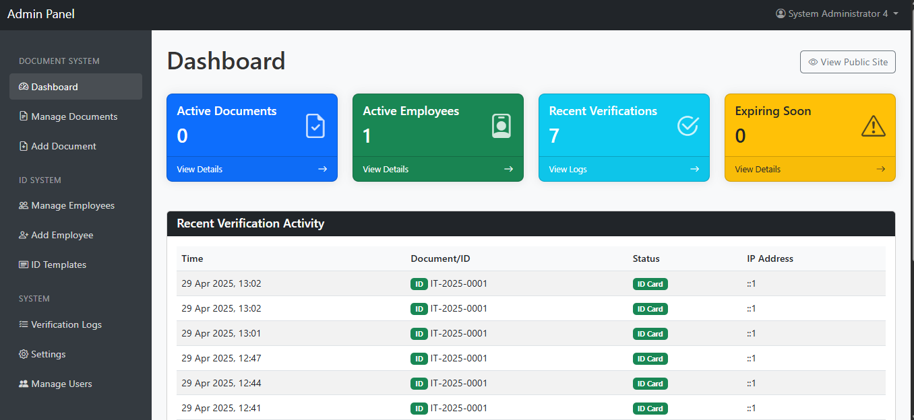
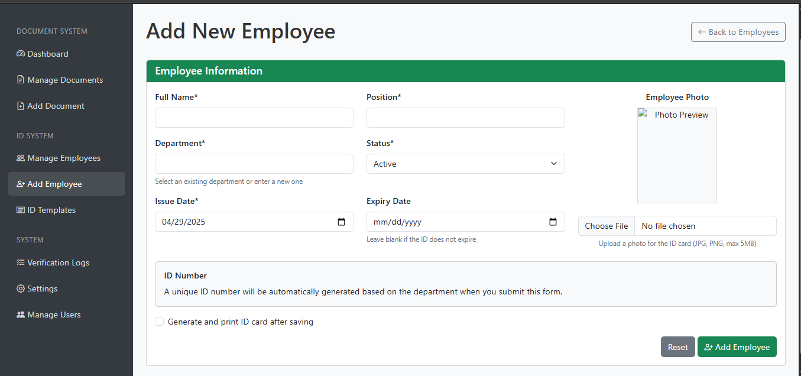
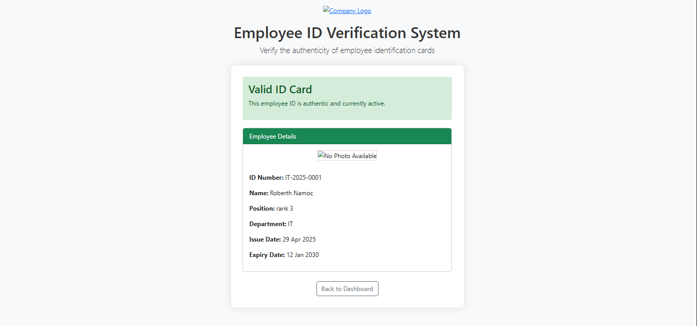
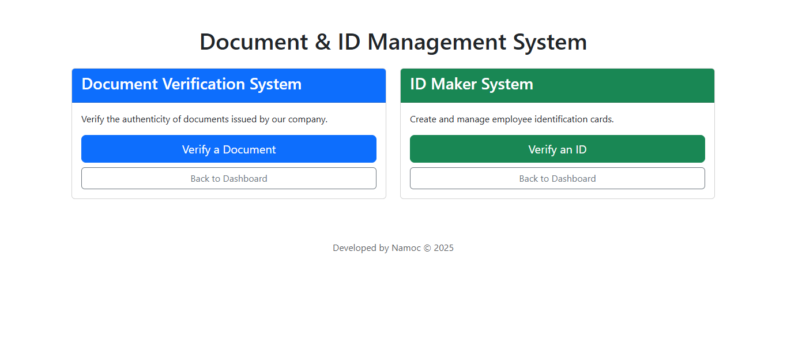
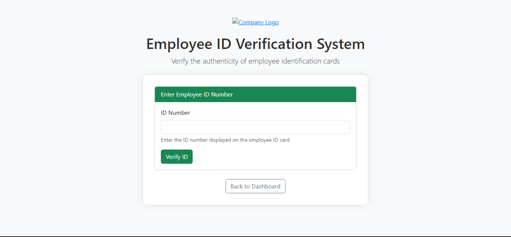

# Document & ID Management System

A PHP/MySQL-based system for managing and verifying digital certificates, documents, and employee ID cards.



## Features

### Document Verification System
- Register and manage official documents
- Generate unique verification codes for each document
- Public verification portal for third parties to verify document authenticity
- Document expiry tracking
- File upload support (PDF, DOC, JPG, etc.)
- QR code generation for easy verification

### ID Maker System
- Create and manage employee ID cards
- Customizable ID templates with different layouts
- Generate unique ID numbers based on department
- Print professional-quality ID cards directly from browser
- Photo upload and management with preview
- QR code generation for verification and security
- Support for landscape orientation ID cards
- Advanced image viewer for photo examination and management

### Administration Features
- Dashboard with key statistics
- User management with different access levels
- Verification logs to track usage
- Batch operations for documents and IDs
- Expiry notifications
- Template management system for ID cards

## Installation

1. **Database Setup**
   - Create a MySQL database
   - Update database credentials in `config/db.php`
   - Navigate to `http://yoursite.com/config/init_db.php` to initialize the database structure

2. **Server Requirements**
   - PHP 7.4 or higher
   - MySQL 5.7 or higher
   - GD library for image manipulation
   - Write permissions for the `uploads` directory

3. **Default Credentials**
   - Username: `admin`
   - Password: `admin123`
   - **Important**: Change the default password after first login

## User Accounts

### System Administrators
| ID | Username | Password | Role | Email | Status |
|----|----------|----------|------|-------|--------|
| 1   | admin1 | admin123 | System Administrator 1 | admin1@example.com | active |
| 2   | admin2 | admin123 | System Administrator 2 | admin2@example.com | active |
| 3   | admin3 | admin123 | System Administrator 3 | admin3@example.com | active |
| 4   | admin4 | admin123 | System Administrator 4 | admin4@example.com | active |
| 5   | admin5 | admin123 | System Administrator 5 | admin5@example.com | active |

**Note**: 
- Most passwords are stored as encrypted hashes in the database for security.
- Only `admin4` uses a plain text password: `admin123`
- All administrator accounts have full system access.
- All accounts are valid until April 29, 2025.

For security purposes, change all default passwords after installation.

## Directory Structure

- `/admin` - Administration panel
- `/assets` - CSS, JavaScript, and images
- `/config` - Database configuration
- `/includes` - Helper functions and reusable code
- `/uploads` - Document and photo uploads
  - `/uploads/documents` - Document files
  - `/uploads/photos` - Employee photos
  - `/uploads/templates` - ID card template files (if applicable)

## Usage

### Document Management

1. **Add a Document**
   - Navigate to Admin Panel > Add Document
   - Fill in the document details and upload a file (optional)
   - The system will generate a unique verification code

2. **Verify a Document**
   - Navigate to the public verification page
   - Enter the document code or scan the QR code
   - View the document status and details

### ID Card Management

1. **Add an Employee**
   - Navigate to Admin Panel > Add Employee
   - Fill in the employee details (name, position, department, etc.)
   - Upload a photo (recommended size: passport photo dimensions)
   - The system will generate a unique ID number based on department

   

2. **Generate & Print ID Card**
   - From the employee list, click on "Print ID" button
   - Select a template from the dropdown menu
   - Preview the ID card in the browser
   - Click the "Print ID Card" button to print
   - Follow the printing instructions for best results

   

3. **ID Card Printing Instructions**
   - Use card stock paper for durability
   - Set printer to "actual size" (100% scale) - do not use "fit to page"
   - Select landscape orientation
   - Turn off headers and footers in browser print settings
   - Use smallest possible margins or "no margins" option
   - Verify the printed card measures exactly 3.375 × 2.125 inches (standard ID size)

4. **View Employee Photos**
   - Access the image viewer by clicking on the employee photo thumbnail
   - The image viewer allows for full-size viewing of employee photos
   - Use the zoom controls to examine photo details
   - Navigate between multiple employee photos using the arrow controls
   - Download images directly from the viewer if needed

   

5. **Verify an ID Card**
   - Navigate to the public ID verification page
   - Enter the ID number or scan the QR code
   - View the employee status and details

   

## Customization

### ID Card Templates
You can customize ID card templates by:
1. Accessing the Templates section in the admin panel
2. Creating a new template or editing an existing one
3. Using HTML for layout and CSS for styling
4. Testing the template before applying it to employees


Available placeholder tags for templates:
- `{FULL_NAME}` - Employee's full name
- `{POSITION}` - Employee's position/rank
- `{DEPARTMENT}` - Employee's department
- `{ID_NUMBER}` - Unique ID number
- `{ISSUE_DATE}` - ID card issue date
- `{EXPIRY_DATE}` - ID card expiry date
- `{PHOTO_PATH}` - Path to employee's photo
- `{QR_CODE}` - QR code for verification

### System Branding
Replace the logo file at `assets/img/logo.png` with your own logo.

### Image Viewer
The system includes an advanced image viewer with the following features:
- **Full-screen Mode**: Examine photos in detail with full-screen display
- **Zoom Controls**: Zoom in/out on images to verify details
- **Navigation**: Browse through multiple employee photos with arrow controls
- **Download Option**: Save images locally when needed
- **Rotation**: Rotate images to correct orientation
- **Mobile Support**: Responsive design works on all devices
- **Crop Functionality**: Adjust photos to fit ID card requirements


The image viewer can be accessed from:
- Employee list view (thumbnail click)
- Employee detail page
- ID card preview screen
- Photo management section

#### Sample Image Display
Here's how employee photos appear in the system:


### Displaying Images in the System
To display images properly within the system, use the following methods:

#### 1. Displaying Employee Photos
```php
// Display employee photo with image viewer
$photoPath = !empty($employee['photo']) ? '../' . $employee['photo'] : '../assets/img/placeholder.jpg';
echo '';
```

#### 2. Displaying Images in ID Cards
```php
// In ID card templates, use the placeholder:


// The system will automatically replace it with:

```

#### 3. Using the Image Viewer API
```javascript
// Open the image viewer for a specific image
function openImageViewer(imgElement) {
    ImageViewer.show(imgElement.src, {
        zoomable: true,
        rotatable: true,
        downloadable: true
    });
}

// Open multiple images as a gallery
function openGallery(employeeId) {
    ImageViewer.showGallery(employeeId, {
        startIndex: 0,
        navigable: true
    });
}
```

#### 4. Image Paths Reference
Common image paths in the system:
- Employee photos: `../uploads/photos/[filename]`
- System logos: `../assets/img/logo.png`
- Default placeholders: `../assets/img/placeholder.jpg`
- ID card templates: `../uploads/templates/[template_id]/background.jpg`

## Security Recommendations

1. Always use HTTPS for secure data transmission
2. Change the default admin password immediately
3. Regularly backup your database
4. Set up proper file permissions
5. Consider implementing rate limiting for verification requests
6. Enable login attempt restrictions

## Troubleshooting

### ID Card Printing Issues
- If ID cards print at wrong size, ensure browser scaling is set to 100%
- For blank printouts, check if your browser is blocking images or scripts
- If QR codes don't scan, try increasing their size in the template

### Document Verification Issues
- If documents cannot be verified, check the verification code for typos
- Ensure the document hasn't expired
- Verify the document hasn't been marked as invalidated in the system

## License

This project is licensed under the MIT License - see the LICENSE file for details. 